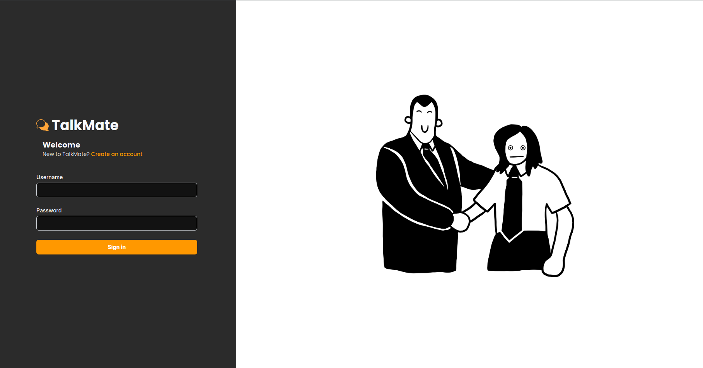
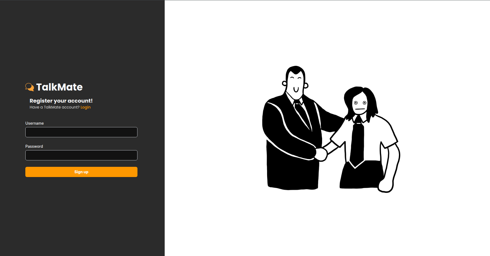
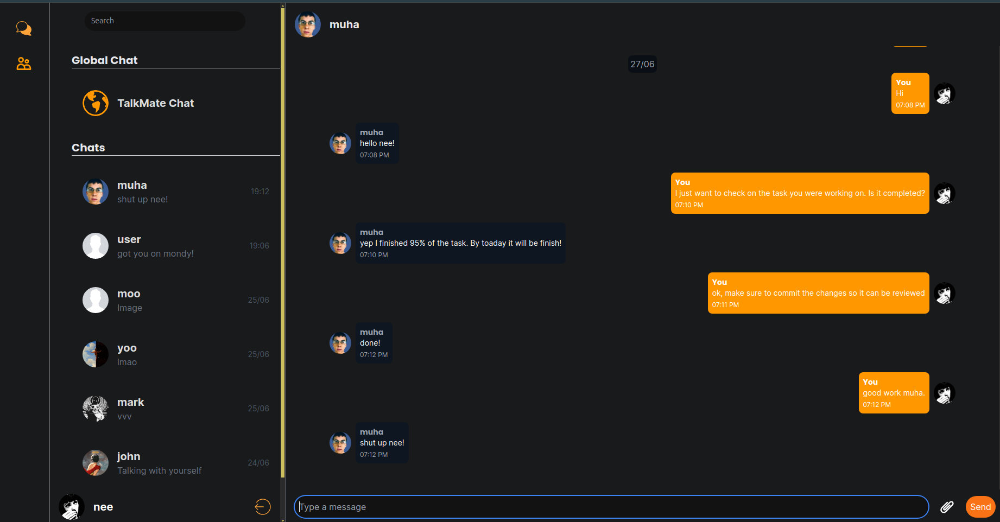
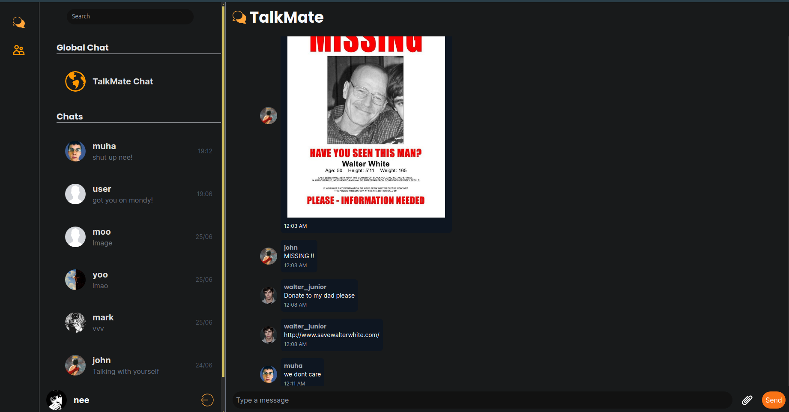
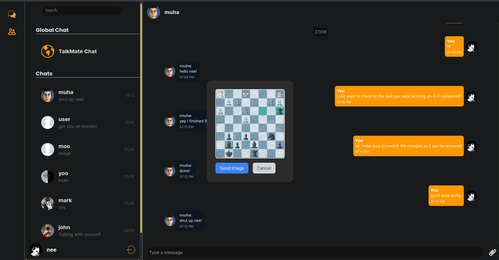
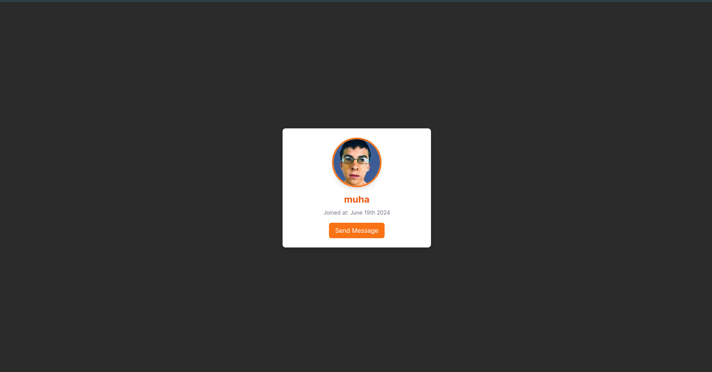
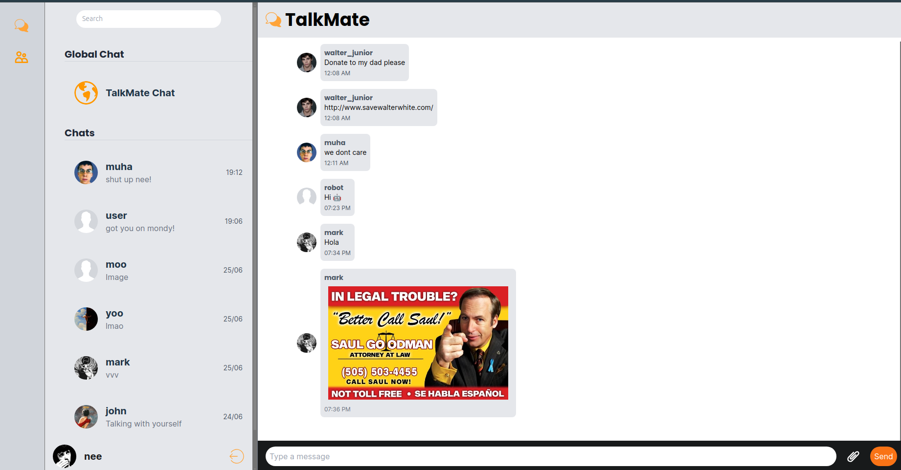
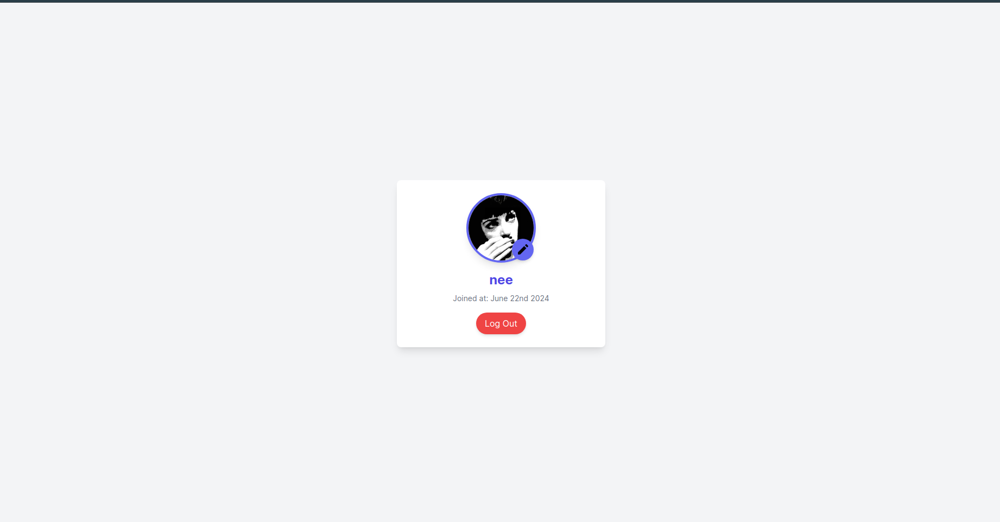

## TalkMate Messaging App 

TalkMate is a messaging app and an assignment along The Odin Project specifically NodeJs course that allows users to chat with their friends and globally. Users can create an account, and chat with their friends. Users can also chat with other users globally.

## Features
- Create an account
- Chat with friends
- Chat with other users globally
- Send images
- Dark mode
- Online and offline users
- User profile
- Update user profile picture

## Usage
You can start using the app by visiting the [TalkMate](https://talkmate.muha.tech) website. You can create an account, and start chatting with your friends and other users globally.

- Login with your username and password

  

- Create an account if you don't have one

  

- Chat with your friends
  
    

- Chat with other users globally
      
    

- Send images

    

- User profile

    

- Light mode

    

- Current user profile

    

## Technologies
- ReactJs
- ExpressJs
- NodeJs
- MongoDB
- Socket.io
- TailwindCSS
- AWS S3

## Extra credit 
extra credit from The Odin Project: 
- Sending images 
- Users list to show which users are currently online
